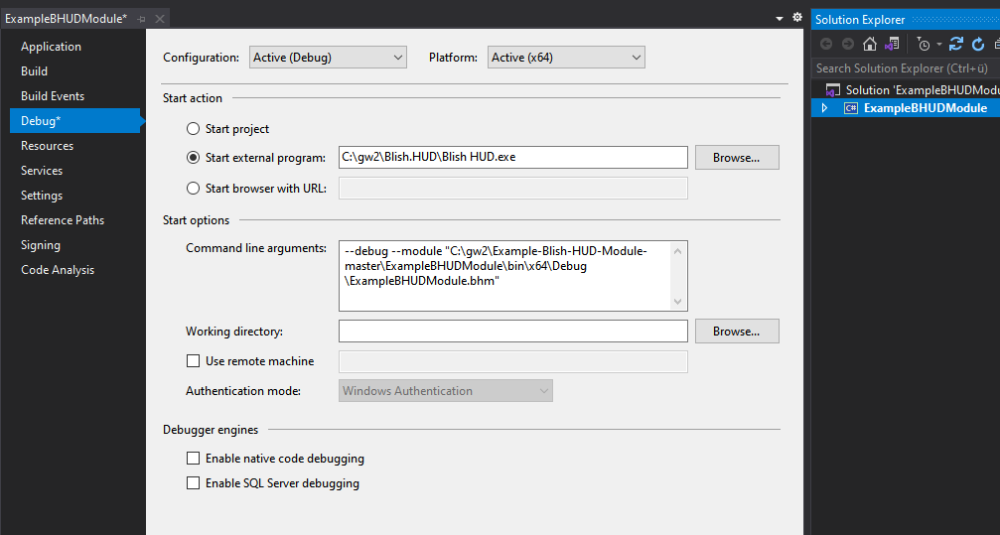

# Example-Blish-HUD-Module

*Additional instructions to come. For module specific help, reference the comments included in ExampleBHUDModule.cs.*

*Please note that these instructions are subject to change as the project moves forward as new features are implemented.*

## Debug Workflow

### Setup

1. Ensure you have the latest version of the Blish HUD project downloaded.
2. Build the Blish HUD project so that Blish HUD.exe is generated.
3. Run "nuget restore" in the Package Manager Console to ensure all NuGet packages are restored. 
3. Add a reference to your module project to the new Blish HUD.exe (usually `C:\Users\username\Source\Repos\BlishHUD\Blish HUD\bin\x64\Debug\Blish HUD.exe`).
4. In your module's **Debug** settings, set the **Start action** to *Start external program:* with the same path used as a reference in step 3.
5. In the same settings, under *Start options* set *Working directory:* to the folder that contains the executable referenced in steps 3 and 4. 

### Workflow Option 1 (Recommended)

By default, you should now be able to run your application - it'll generate the *.bhm* file automatically for you and place it in the modules directory that Blish HUD uses.

This uses the script found in the "BuildScripts" directory called "PackageModule.ps1" and is configured to run after your module is built as a *.dll* under the *Build Events tab > Post-build event command line* in your project settings.

As long as your project generates a PDB file, it will be loaded by the module loader at runtime.

If your project contains references that are not already contained in the Blish HUD application as a reference, you will need to embed these DLLs directly into your module dll.  The easiest way to do this is to ensure that Fody and Costura.Fody are added to your project references.  They will automatically handle packaging your references.  If we are able to switch to `AssemblyLoadContext` for module loading in the future, we may be able to support resolving references at runtime that are located within the *.bhm* archive and load them in raw like we are the module *.dll*.

### Workflow Option 2

You can save some time by disabling the archive script (remove it from your build events under *Post-build event command line:*).  This will **not** automatically place new builds in the modules folder of Blish HUD.  Instead, you will need to create a junction directory in the modules folder that points to your modules output directory.

If Blish HUD is launched with the compile constant "DEBUG," it will also accept loading modules from a directory.  Please note that this method requires using Blish HUD in Visual Studio to debug since that is when the DEBUG constant is defined.  This may change in the future when a debug flag is implemented so that it can be passed to the Blish HUD executable directly.